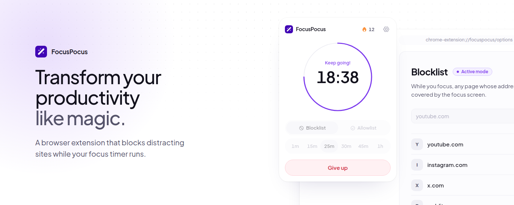

<div align="center">


# FocusPocus

**Transform your productivity like magic.**<br />
A free, open source browser extension that blocks distracting sites while your focus timer runs.

<a href="https://chromewebstore.google.com/detail/focuspocus-in-magical-foc/mhfhegccdlndlipjicelombmchnpdebc"></a>
<a href="https://addons.mozilla.org/firefox/addon/focuspocus-in-magical-focus/"></a>


<br />
<br />



</div>

## Features

- **Focus timer:** presets from 1 minute to 1 hour, or type your own time.
- **Focus screen:** during a session, distracting sites are covered by a screen with the time left.
- **Blocklist or allowlist:** block a handful of sites, or everything except the tools you work with.
- **Streak:** every finished session adds one. Giving up takes two clicks and resets it to zero.
- **Sounds and notifications:** optional, and all off until you turn them on.
- **Light and dark, in your language:** English, Brazilian Portuguese and Spanish.
- **Private:** no account, no tracking, no servers. Your lists and your streak stay in your browser.

Watch the [demo video](https://www.youtube.com/watch?v=AeRzctRV-4s).

## Run it locally

Requires [Bun](https://bun.sh).

```bash
git clone https://github.com/gugeldev/focus-pocus.git
cd focus-pocus
bun install            # dependencies and git hooks

bun run dev:chrome     # builds to apps/extension/dist/chrome on every save
bun run dev:firefox    # builds to apps/extension/dist/firefox
bun run dev:web        # the website, on http://localhost:3003
```

Then load the build in your browser:

- **Chrome:** open `chrome://extensions`, turn on developer mode, click _Load unpacked_ and pick `apps/extension/dist/chrome`.
- **Firefox:** open `about:debugging`, click _Load Temporary Add-on_ and pick `apps/extension/dist/firefox/manifest.json`.

| Folder              | What it is                                                                   |
| ------------------- | ---------------------------------------------------------------------------- |
| `apps/extension`    | The browser extension (React, Tailwind CSS, webpack)                         |
| `apps/web`          | The website (Next.js), with working copies of the extension's screens        |
| `packages/ui`       | The design system both apps are built with                                   |
| `packages/locales`  | The extension's text in English, Portuguese and Spanish                      |
| `assets/store`      | The store images, exported from the website by `bun run store:shots`         |

## Contributing

`main` always matches the published version. The next one is built in a `release/<version>` branch (currently `release/1.2.0`), and every change reaches it through a pull request.

1. Fork the repository and branch off the current release branch, named after the kind of change (`feat/pause-button`, `fix/overlay-flicker`).
2. Write commit messages in English following [Conventional Commits](https://www.conventionalcommits.org) (`feat(popup): add pause button`).
3. Make sure `bun run lint`, `bun run typecheck`, both extension builds and `bun run build:web` pass.
4. Open a pull request **to the current release branch, not to `main`**.

The git hooks check most of this for you: Biome on commit, the commit message format, and the type-check on push.

## Contributors

Thanks to everyone who has contributed to FocusPocus.

<a href="https://github.com/gugeldev"></a>
<a href="https://github.com/Ryrden"></a>
<a href="https://github.com/gabireze"></a>
<a href="https://github.com/fatekkl"></a>

## License

[MIT](LICENSE)
